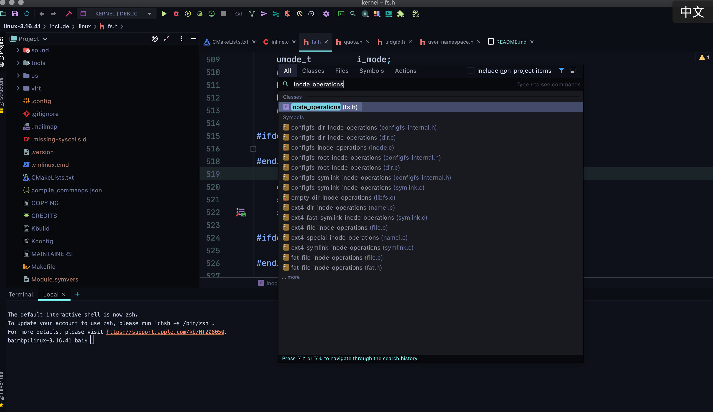

# 如何使用clion阅读linux内核代码

## 最直接方式
clone本仓库
```
git clone https://github.com/nkbai/clion-linux-kernel-3.16.git
```
或者

```
git clone https://gitee.com/nkbai/clion-linux-kernel-3.16.git
```

然后使用clion打开本工程即可. 

**这个版本针对的是arm处理器,开发板是vexpress-a9**


## 自定义版本

如果你关注的平台不是arm,比如x86,或者不是3.6版本,而是其他版本,那么你就可以自己构造这么一个工程.


### 1. 正常编译
选个linux平台,比如ubuntu,可以正常编译内核. 
然后
```
make clean
bear make zImage
```
其中最关键的是`bear make zImage`,他会在内核源码目录下生成`compile_commands.json`. 记录完整的编译过程.

### 2. 生成CMakeLists.txt

这里需要用到工具[kernel-grok](https://github.com/habemus-papadum/kernel-grok.git)

```
sudo apt install ruby
git clone https://github.com/habemus-papadum/kernel-grok.git
cd clion-linux-kernel-3.16
../kernel-grok/generate_cmake
```

这时候就会生成CMakeLists.txt. 然后打开`CMakeLists.txt`,添加:
```
SET(CMAKE_C_COMPILER "gcc")
include_directories(".")
include_directories("./include")
```
否则会出现头文件找不到的情况.

### 3. 愉快的阅读源码吧.



## 其他

这里提供了一个思路,其实所有不支持cmake的传统c/c++项目都可以通过这种方式来导入,至少代码编写,阅读可以流畅许多.


